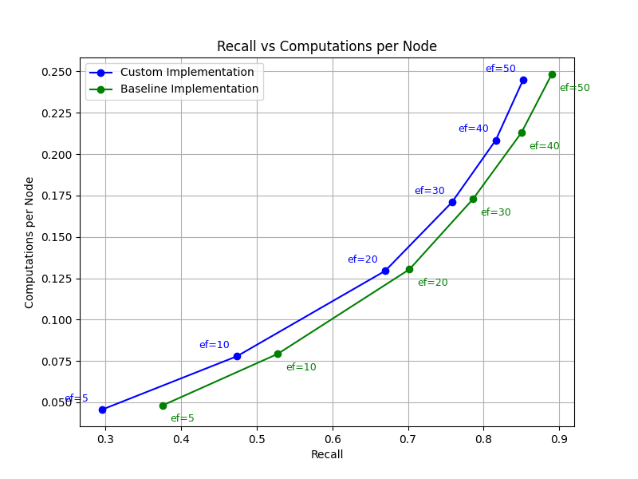

# Navigable Graphs Python

## Results

Syntetic data results:

```Python
m = 50, m0 = 50, ef_construction = 30, n = 10000, dim = 128, k = 5
ef_values = [5, 10, 20, 30, 40, 50]
```



Results on real data (run the code as in the example from [Usage](#usage)):

```Python
m = 50, m0 = 50
```

| Dataset       | Method             | Average recall | Avg calc |
| ------------- |:------------------:|---------------:|---------:|
| sift10k       | baseline           |         0.9739 |   246.75 |
| sift10k       | custom             |         0.9780 |   244.53 |
| sift1m        | baseline           |         0.8074 |   420.43 |
| sift1m        | custom             |         0.7943 |   413.52 |

## Usage

Python based research tool for studying navigable graphs for nearest neighbour search

Using the SIFT dataset:
```Bash
python navigable-graphs.py --dataset sift
```

Using synthetic data with 3D vectors:
```Bash
python navigable-graphs.py --dataset synthetic --K 20 --k 5 --dim 3 --n 500 --nq 100 --ef 20 --M 2
```